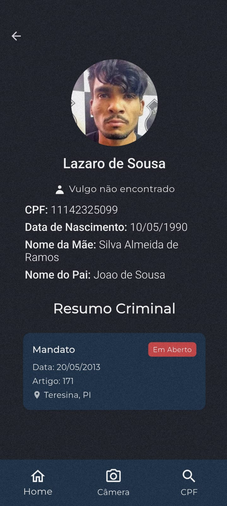

<h1 align="center"> VisionApp - Mobile </h1>

## Sumário

* [Integrantes](#integrantes)
* [Descrição](#descrição)
* [Requisitos](#requisitos)
* [Tecnologias](#tecnologias)
* [Fluxo do Software](#fluxo-do-software)
* [Funcionalidades](#funcionalidades)
* [Dificuldades](#dificuldades)
* [Resultados](#resultados)
* [Conclusao](#conclusao)

## Integrantes

- Anderson do Vale - [and3510](https://github.com/and3510) 
- Beatriz Barreto - [whosbea](https://github.com/whosbea)
- Cristovam Paulo - [cristovam10000](https://github.com/cristovam10000)
- Gustavo do Vale - [gustavodovale](https://github.com/gustavodovale)
- Lucas Cesar
- Agenor Neto

## Descrição

Desenvolvimento de um aplicativo de segurança pública que utiliza reconhecimento facial baseado em IA para identificação de indivíduos durante abordagens policiais. O sistema compara a imagem capturada com um banco de dados oficial e exibe informações como nome, CPF e pendências judiciais. Caso haja mandado de prisão ativo, um alerta é enviado ao policial, agilizando a tomada de decisão.

## Requisitos

### **1. Captura de Imagem**  
- Permitir a captura de imagem em tempo real via câmera do dispositivo móvel.  
- Processar a imagem capturada para extração das características faciais.  

### **2. Processamento e Reconhecimento Facial**  
- Identificar pontos-chave do rosto para comparação com registros armazenados.  
- Realizar a correspondência entre a imagem capturada e as fotos cadastradas no banco de dados.  

### **3. Consulta e Validação da Identidade**  
- Consultar o banco de dados e validar a identidade do indivíduo.  
- Recuperar e exibir as seguintes informações em caso de correspondência:  
  - Nome completo  
  - Nome da mãe  
  - CPF  

### **4. Verificação de Pendências Judiciais**  
- Verificar automaticamente se há registros de busca ou mandados de prisão ativos.  
- Realizar a consulta de forma automática e em tempo real.  

### **5. Exibição de Resultados**  
- Exibir a confirmação da identidade na interface do usuário.  
- Gerar um alerta para o policial caso haja alguma pendência judicial.  

### **6. Segurança e Privacidade**  
- Restringir o acesso ao sistema apenas a usuários autorizados.  
- Registrar todas as consultas para fins de auditoria e segurança.  
- Garantir que o armazenamento e processamento das informações sigam normas de proteção de dados.  

## Tecnologias

- Dart
- Flutter
- Firebase

## Fluxo do Software

 

## Funcionalidades

### Back-End (API)
- Autenticação via Firebase JWT
- Upload e reconhecimento facial com retorno de CPF
- CRUD de ficha criminal (ligada a uma pessoa)
- Alertas de segurança por CPF
- Upload de imagens e associação com registros

### Front-End (App Flutter)
- Tela de login com Firebase
- Visualização da ficha criminal de cada pessoa com mandato aberto
- Visualização e alerta de ocorrência
- Scanner de rosto e envio de imagem para API
- Pesquisa por CPF

## Dificuldades

- Integração com API
- Configuração da Camera no Aplicativo
- Configuração da Detecção do Rosto pela Camera
- Organização da arquitetura do aplicativo

## Resultados

 

  
  
  

  
  
  

## Conclusao

O VisionApp - Mobile foi desenvolvido com o objetivo específico de auxiliar agentes de segurança na identificação de indivíduos com pendências judiciais. Diferente de sistemas de vigilância em massa, o aplicativo é voltado exclusivamente para uso em abordagens policiais, onde há a necessidade de verificação rápida e precisa da identidade de pessoas em conflito com a lei.

Com a integração de reconhecimento facial baseado em IA e um banco de dados oficial, o aplicativo permite capturar a imagem de um suspeito, compará-la com registros existentes e, em caso de correspondência, exibir informações como nome, CPF e eventuais mandados de prisão ativos. Essa resposta em tempo real aumenta a agilidade das ações policiais e reduz os riscos envolvidos nas abordagens.

Além disso, o VisionApp reforça o compromisso com a privacidade e a legalidade, ao restringir o uso do sistema apenas a profissionais autorizados e registrar todas as consultas para fins de auditoria. O projeto ainda está em desenvolvimento, mas já apresenta resultados promissores e tem potencial para evoluir como uma ferramenta estratégica no combate à criminalidade.